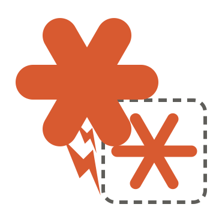

# Running Claude in Podman containers



The main Claude used in VSCode still runs like normal -- however I have it in (mostly) "ask" mode -- no `--dangerously-skip-permissions` or `auto` modes for it.

However, it will spawn a long-lived lightweight container
( [Containerfile](Containerfile) )
per repo, that it can talk to.  This container is in `auto` mode, and has a generous amount of packages installed that it often uses.

Each container is built and run and `exec` into via
[claude-pod](claude-pod)
script.  The script automatically makes the working repo r/w -- and the other mounts (below) readonly.  Note that no `.ssh` credentials, the main "controlling claude" dir, other `$HOME` setting areas are not made available to the containers.

I *did* elect to give the containers open internet access to `https://` hosts.  YMMV.

Claude will automatically start containers if/as needed.

If you reboot your machine, the containers go away, but they'll just respawn later on demand.


## TODO
- limit outbound internet access from containers to `https://` only (seems not actually in place per *another* claude ;-)


## Setup

I'm using `podman` instead of docker -- `brew install podman`.

I give it generous r/o access to most of the repos I use and have cloned.

This is the "podman machine" setup (a Mac needs a linux VM in order to run "containers").
Podman machine is this linux VM.
These volume mounts get setup to be the _maximum_ an actual later running podman container
can "see".

**macOS only.** On Linux, containers run on the host kernel -- there is no VM,
so skip this whole step. Your filesystem is already visible to podman and
`CLAUDE_PODS` is all you need to set. The `claude-pod` script itself is the same
on both.

You only have to run this once.

List the dirs to share as a space-separated `CLAUDE_PODS` env var
(e.g. in your `~/.zshrc` or `~/.bashrc`).  The snippet below works in both `bash` and `zsh`.
One or more dir of cloned dirs is fine
(just keep in mind that claude container pods can read anything you set in CLAUDE_PODS).


```sh
# set env var CLAUDE_PODS to a SPACE separated string of dirs that can be read
# eg: export CLAUDE_PODS="$HOME/dev $HOME/repo"

VOLS=()
for d in $(echo ${CLAUDE_PODS?}); do VOLS+=(-v "$d:$d"); done

mkdir -p ~/.claude-pod
podman machine stop
podman machine rm podman-machine-default
podman machine init --cpus 5 --memory 4096 \
  -v $HOME/.claude-pod:$HOME/.claude-pod \
  -v /private:/private \
  -v /var/folders:/var/folders \
  "${VOLS[@]}"
podman machine start
```
