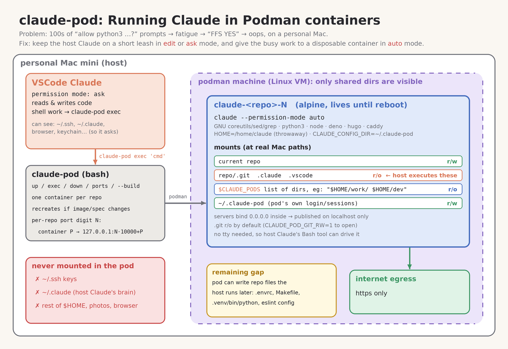

# Running Claude in Podman containers


The main Claude used in VSCode or your terminal still runs like normal -- however I have it in (mostly) "ask" and "edit" mode -- no `--dangerously-skip-permissions` or `auto` modes for it.

To run other commads to get tasks accomplished, it will spawn a long-lived lightweight container
( [Containerfile](Containerfile) )
per repo, that it can talk to.  This container is in `auto` mode, and has a generous amount of packages installed that it often uses.

This avoids the "prompt fatique" of continuously being asked "can I run this?" (you: interrupted again, scans request, yah yah fine) ... in a loop. 😎



Each container is built and run and `exec` into via the
[claude-pod](claude-pod)
script.  The script automatically makes the working repo r/w -- and the other mounts (below) readonly.  Note that `.ssh` credentials, the main "controlling claude" dir, other `$HOME` setting areas are **not** made available to the containers.

I *did* elect to give the containers open internet access to `https://` hosts.  YMMV.


Once you are setup, Claude will automatically start containers if/as needed.

If you reboot your machine, the containers go away, but they'll just respawn later on demand.


## Setup

I'm using `podman` instead of docker -- MacOS: `brew install podman`.

I give it generous r/o access to most of the repos that I use and have cloned.


### MacOS Setup

This is the "podman machine" setup (a Mac needs a linux VM in order to run "containers").
Podman machine is this needed linux VM.
The volume mounts below (CLI args `-v ..`) get setup to be the _maximum_ that an actual later running podman container can "see".

On Linux, containers run on the host kernel -- there is no VM,
so skip this whole step. Your filesystem is already visible to podman and
`CLAUDE_PODS` is all you need to set. The `claude-pod` script itself is the same on both.

You only have to run this once.

List the dirs to share as a space-separated `CLAUDE_PODS` env var
(e.g. in your `~/.zshrc` or `~/.bashrc`).  The snippet below works in both `bash` and `zsh`.
One or more dir of cloned dirs is fine
(just keep in mind that claude container pods can read anything you set in CLAUDE_PODS).


```sh
# set env var CLAUDE_PODS to a SPACE separated string of dirs that can be read
# eg: export CLAUDE_PODS="$HOME/dev $HOME/repo"
# NOTE: this removes any prior default podman machine first.

VOLS=()
for d in $(echo ${CLAUDE_PODS?}); do VOLS+=(-v "$d:$d"); done

mkdir -p ~/.claude-pod
podman machine stop
podman machine rm podman-machine-default
podman machine init --cpus 5 --memory 4096 \
  -v $HOME/.claude-pod:$HOME/.claude-pod \
  -v /private:/private \
  -v /var/folders:/var/folders \
  "${VOLS[@]}"
podman machine start
```
After each reboot, you'll need to rerun `podman machine start`.


## Setup Continued

Clone this repo somewhere locally.  The example below cloned into `$HOME/work/`.

You then go to *another* repo that you want to work in, and ask that Claude to read *this* cloned repo (give it read perms if prompted).  Ask Claude to be able to run these commands:
```sh
$HOME/work/claude-pod/claude-pod exec *
$HOME/work/claude-pod/claude-pod up
$HOME/work/claude-pod/claude-pod ports
```
typically you get prompted to add lines like these to your `$HOME/.claude/settings.json`:

```json
{
  "permissions": {
    "allow": [
      "Bash(/Users/tracey/work/claude-pod/claude-pod exec *)",
      "Bash(/Users/tracey/work/claude-pod/claude-pod up)",
      "Bash(/Users/tracey/work/claude-pod/claude-pod ports)",
    ]
  }
}
```

You can then give your main Claude (_just_) "edit" privs (r/w files) to the repo you're working in -- and everything else it might want to do can run in a long-running, restartable container that it takes care of building and running, for whatever arbitrary commands it might want to run.  So if it wants to:
- install extra packages beyond what's in [Containerfile](Containerfile)
- create and run arbitrary python commands to run or check things
- fire up a `caddy` webserver
- lint check with `deno` or `node`
- or just about anything else
-- it can send all that to the podman container and collect the results, writing to your repo if needed.

There is one container per repo you work on.  Any files or dirs in your `$CLAUDE_PODS` var are mounted _readonly_ inside each container, with the repo you're working on mounted `read/write`.

So if you have multiple related repos, Claude can look around (readonly) into your other repos in `$CLAUDE_PODS` for information it might need to complete a task.

No `$HOME/.ssh` or main `$HOME/.claude` or other credentials can be "seen" in your containers.


### Optional running Claude directly in containers
You can enter a container and additionaly auth Claude (once, for all your repos) to run on CLI/terminal inside that container via:
```sh
# `cd` to a cloned repo you are working in
# run the `claude-pod` command from wherever you cloned *this* repo, eg:
$HOME/work/claude-pod/claude-pod
```
The auth will get setup into your separate `$HOME/.claude-pod/` dir.
Your `$HOME/.claude/` and `$HOME/.claude-pod/` remain separate, so privs/allowances stay different for each.


### Network: https only, by default
Outbound traffic from each container is limited to **TCP/UDP 443** (https, including HTTP/3). Everything else (plain `http://` on port 80, ssh, odd ports, DNS to any server but the container's own) is **rejected immediately** with "connection refused", not left to time out.

Still allowed:
- **DNS**, but only via podman's own forwarders (from the container's `/etc/resolv.conf`), which hand lookups to your Mac's resolver. So on a work VPN, containers see the VPN's DNS too.
- **Replies on connections made *into* the container**, so published ports (`claude-pod ports`) work.
- **Loopback** inside the container (e.g. a `caddy` on `:80` testing itself).
- **ICMP**, so IPv6 keeps working.

The rules are `nftables`, installed by container-root at every start through a one-off privileged `exec`. The container itself gets no extra capabilities, and runs with `no-new-privileges`, so the uid Claude runs as can't list or remove them.

The filter limits *ports*, not *destinations*. With a VPN up, container traffic goes through your Mac's routes, so internal `https` services on the VPN are reachable.

To turn the filter off for a repo's container (it gets recreated):
```sh
CLAUDE_POD_NET=open claude-pod up
```
